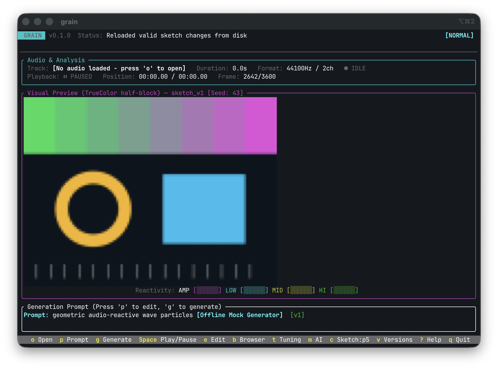
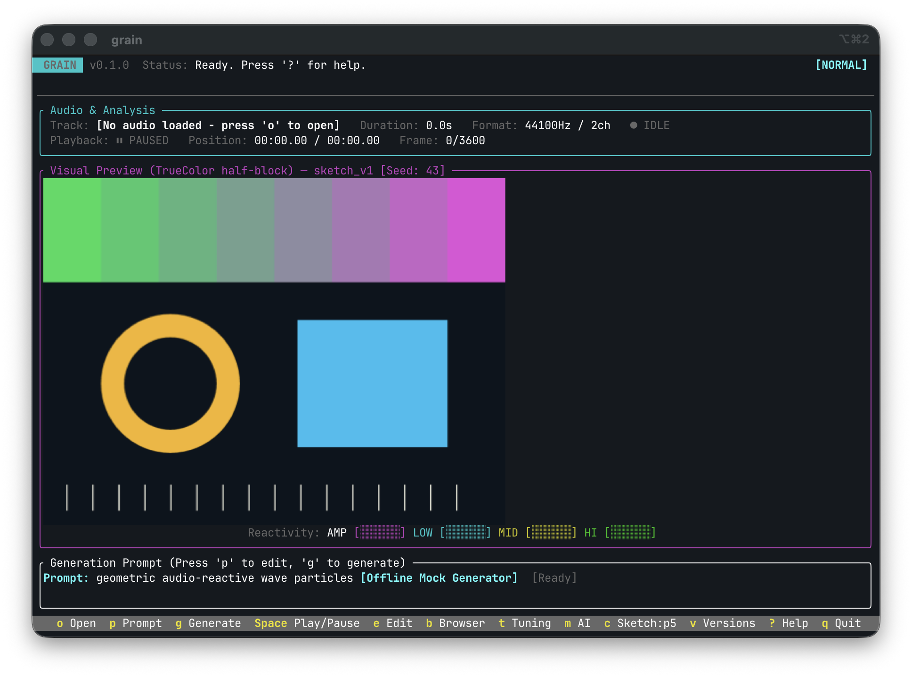

# Real iTerm2 validation: incomplete

Environment: iTerm2 3.6.11, Apple M5, 16 GiB RAM. Tested optimized Grain from
branch `feat/26-iterm2-preview` at `df3309b`, forced iTerm2 backend, 30 FPS clock.
The dedicated window used a temporary HOME and working directory, offline
generation, and no audio. No pre-existing terminal sessions were used.

Observed checks:

- An inline image is visible inside the preview region.
- Help is readable without an inline image covering the modal.
- Returning from Help, pausing, resizing and reloading a source from disk produce
  an image in the resized preview region.
- The preview title incorrectly continues to report the half-block backend.

## Acceptance failure: paused quality after load

The same static source appears visibly blurred after playback/load adaptation,
but sharp after restarting Grain in the same-sized window. Source colors and
geometry do not depend on frame or time. Window bounds for both screenshots are
900 x 650 logical units; only the dedicated test window was captured.

The implementation recovers quality after a sequence of inexpensive frames.
Because a paused sketch stops requesting frames, that recovery does not restore
quality for the final paused image. The correction now requests one maximum-
quality still when paused, without waiting for the recovery counter. The new
`iterm2_paused_quality_test` compares its complete packet with the full-quality
encoder output and checks that time/source remain unchanged and no repeated
paused frames are requested. The full quality gate passes. A post-fix real-window
comparison remains to be completed; the screenshots above show the original bug.

## Still unproven

Sustained visible FPS, combined terminal/process CPU, keyboard latency, external
editor transitions, scrollback behavior and trails over prolonged playback are
not established by these screenshots. A process sample during playback showed
26.4% CPU for Grain, but it is not a controlled aggregate performance result.

The corrected PTY scenario also did not complete: the initial frame did not
arrive within its one-second startup deadline. That timeout is not evidence of a
rendering defect; startup did complete in the real terminal. PR #49 remains a
draft and #26 remains open.
